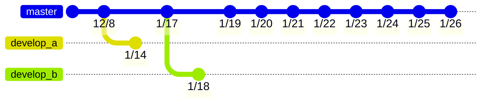

```mermaid
%%{init: {
  'gitGraph': {
    'mainBranchName': 'master',
    'rotateCommitLabel': false
  },
  'themeVariables': {
    'commitLabelFontSize': '18px'
  }  
}}%%
%% これから新しく使うブランチを宣言
gitGraph
    commit id: " "
    %% 12/8 から develop_aを分岐 start
    commit id: "12/8"
    branch develop_a
    checkout develop_a
    commit id: "1/14"
    checkout master
    %% 12/8 から develop_aを分岐 end
    %% 1/17 から develop_bを分岐 start
    commit id: "1/17"
    branch develop_b
    checkout develop_b
    commit id: "1/18"
    checkout master
    %% 1/17 から develop_bを分岐 end
    commit id: "1/19"
    commit id: "1/20"
    commit id: "1/21"
    commit id: "1/22"
    commit id: "1/23"
    commit id: "1/24"
    commit id: "1/25"
    commit id: "1/26"
```